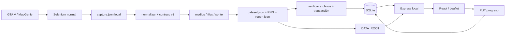

# Arquitectura

- `scraper/browser.py`: sesión Selenium y captura de respuestas observadas, sin cookies exportadas.
- `normalize.py`: adaptador específico al payload observado, identidades, medios y cobertura.
- `media.py`: validación de destinos, límites, decodificación, hashing, atomicidad y reintentos.
- `run.py`: fases y checkpoints. Una sesión, concurrencia 1, reanudación por manifest.
- `demo.py`: fixtures visuales propias; no acceso a MapGenie.
- `schemas/`: contrato y tipos generados. `shared/`: transformación e invariantes TS.
- `backend/src/db/`: migración e importación; `media/`: instalación y confinamiento de archivos.
- `backend/src/app.ts`: API sin URLs remotas ejecutables. `progress/`: reset explícito.
- `frontend/src/map,categories,detail/`: mapa, filtros/iconos y galería. Markdown se carga al abrir detalle.

Configuración real: .env raíz, DATA_ROOT, DB_PATH, PORT, API_TARGET; valores por defecto
en .env.example. Los npm scripts de componente fijan el directorio de trabajo.
Backend escucha solo 127.0.0.1. Vite proxifica API/medios por rutas relativas.
No cuentas, Docker, proxy arbitrario, nube, PWA ni framework adicional.

El contrato conserva coordenadas originales. No hay conversión de juego a mapa inferida.
Los datos usan grados del mapa web artificial; Leaflet EPSG3857 proyecta igual que la fuente.
La extracción selecciona una de las cuatro capas observadas. No hay selector multicapas en UI v1.
